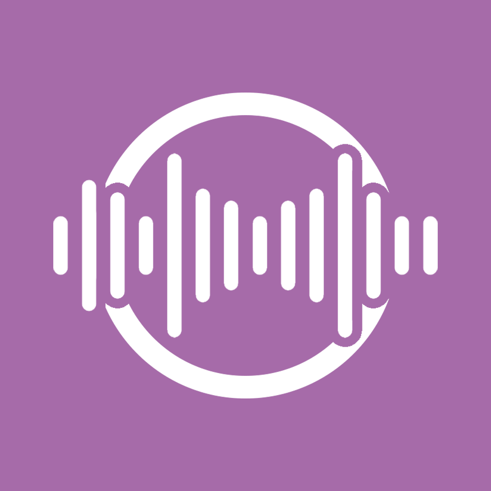

<p align="center">
  
</p>

<h1 align="center">Supwave2</h1>

<p align="center">
  A Material 3 Expressive music player client for <a href="https://www.navidrome.org/">Navidrome</a> servers.
</p>

---

> **Note:** This app was almost entirely generated by [Claude](https://claude.com/claude-code), with only minor manual tweaks from me.

## Features

- Real Navidrome/Subsonic integration (dashboard, playlists, search, liked songs)
- Real audio playback with a persistent Android media notification (play/pause/next/stop)
- Offline downloads and image caching
- Playlist management (create, delete, add/remove songs)
- Playback session that survives closing and reopening the app
- Full Material 3 Expressive styling (Android 13-16 dynamic color, expressive shapes/motion)

## Getting started

This is a standard Flutter project. See [Flutter's docs](https://docs.flutter.dev/) for setup, then:

```sh
flutter pub get
flutter run
```
